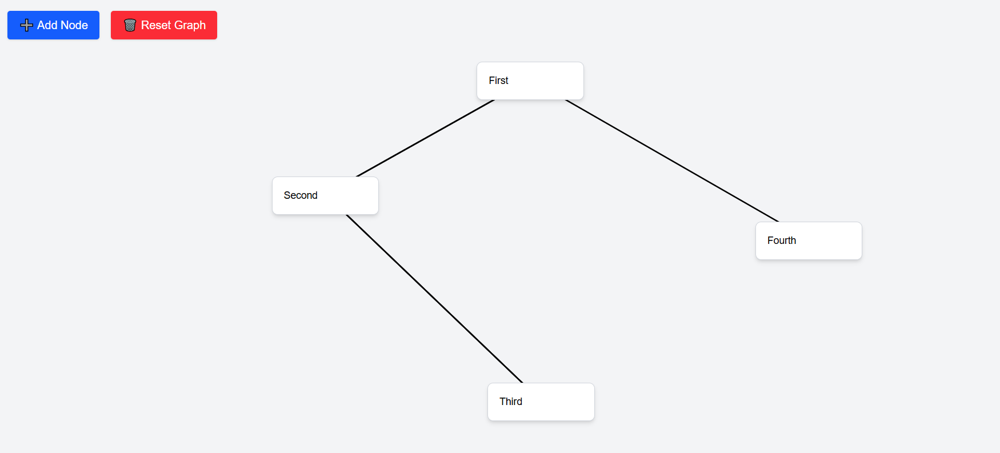

# 🧠 Mindmapr

Mindmapr is a simple and intuitive mind-mapping tool built with **React**, **TypeScript**, and **Tailwind CSS**. It allows users to create draggable nodes, link them visually with arrows, and persist data using localStorage. Ideal for brainstorming, note-taking, and visualizing relationships between ideas.

## 🔍 Features

- ➕ Add nodes dynamically  
- ✏️ Double-click to edit node content  
- 🖱️ Drag-and-drop node positioning  
- 🔗 Click to connect nodes with arrows  
- 🧹 Reset graph with one click  
- 💾 Auto-saves to `localStorage`

## 🚀 Tech Stack

- **Framework:** React (with Next.js optional)
- **Language:** TypeScript
- **Styling:** Tailwind CSS
- **State Management:** useState, useEffect
- **Persistence:** localStorage
- **UUID:** For unique node identification

## 📸 Screenshot

![Mindmapr Screenshot]